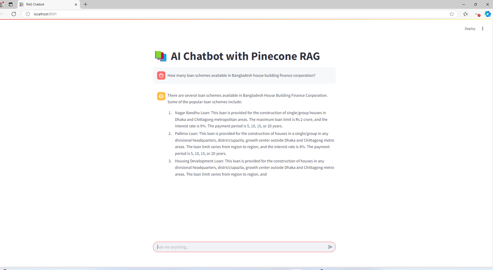

# 📚 RAG Based Chatbot R&D for BD Govt Organization

This is a **Retrieval-Augmented Generation (RAG) Chatbot** built with **Pinecone for vector search**, **local embeddings using Sentence Transformers**, and **Llama as the LLM**. The chatbot retrieves relevant context from a document store and generates responses using a local Llama model. I am doing R&D on different models for CPU inference and better accuracy.

---

## 🖼️ Demo


---

## 🚀 Features

- **Retrieval-Augmented Generation (RAG)**: Retrieves relevant documents from Pinecone before generating responses.
- **Local Embeddings**: Uses `sentence-transformers` instead of OpenAI embeddings.
- **Llama Model for Chat Completion**: Runs a local Llama model for response generation.
- **Streamlit UI**: Interactive chat interface built with Streamlit.

---

## 📦 Installation

### 1️⃣ Clone the Repository
```sh
git clone https://github.com/forhadsidhu/bhbfc_gpt
cd BHBFC_chatbot
```

### 2️⃣ Create a Virtual Environment (Optional but Recommended)
```sh
python -m venv venv
source venv/bin/activate  # On Windows: venv\Scripts\activate
```

### 3️⃣ Install Dependencies
```sh
pip install -r requirements.txt
```

### 4️⃣ Set Up Environment Variables
Create a **`.env`** file in the project root and add your Pinecone API key:
```env
PINECONE_API_KEY=your_pinecone_api_key
```

---

## 🛠 Configuration

### 🔹 Pinecone Index
Ensure your Pinecone index has the **correct dimensions** matching your embedding model:
- `all-MiniLM-L6-v2` → **384 dimensions**
- `all-mpnet-base-v2` → **768 dimensions**

If you need to create a new index:
```python
from pinecone import Pinecone

pc = Pinecone(api_key="your_pinecone_api_key")
pc.create_index(name="langchain-demo", dimension=768, metric="cosine")
```

### 🔹 Change Embedding Model (If Needed)
By default, the chatbot uses:
```python
embedding_model = SentenceTransformer("all-mpnet-base-v2")  # 768 dimensions
```
If your Pinecone index uses a different dimension, change the model accordingly.

---

## ▶️ Running the Chatbot

### **Start the Streamlit App**
```sh
streamlit run app.py
```
This will open a web UI where you can chat with the bot.

---

## 🏗 Project Structure
```
📂 rag-chatbot
 ├── 📄 app.py             # Main Streamlit app
 ├── 📄 requirements.txt   # Required Python dependencies
 ├── 📄 .env               # Pinecone API key (Not included in the repo)
 ├── 📂 models/            # Directory for storing the Llama model
 ├── 📂 data/              # Store any preprocessed documents (if needed)
 ├── 📄 demo.png           # Screenshot of the chatbot UI
 ├── 📄 README.md          # Project documentation
```


## 🛠 Troubleshooting

### **Vector Dimension Mismatch Error**
❌ `Vector dimension 384 does not match the dimension of the index 768`
- **Solution:** Ensure your embedding model and Pinecone index dimensions match.
- **Fix:** Use `all-mpnet-base-v2` for 768-dimension or recreate the Pinecone index with 384 dimensions.

### **Pinecone API Key Error**
❌ `Missing Pinecone API key! Check your .env file.`
- **Solution:** Ensure you have added your Pinecone API key in the `.env` file.

---

## 🔗 Resources

- [Pinecone Docs](https://docs.pinecone.io/)
- [Sentence Transformers](https://www.sbert.net/)
- [Llama.cpp](https://github.com/ggerganov/llama.cpp)

---

## 📝 License

This project is licensed under the MIT License.

